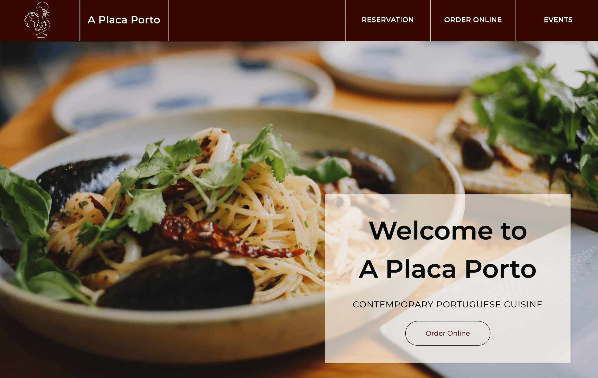
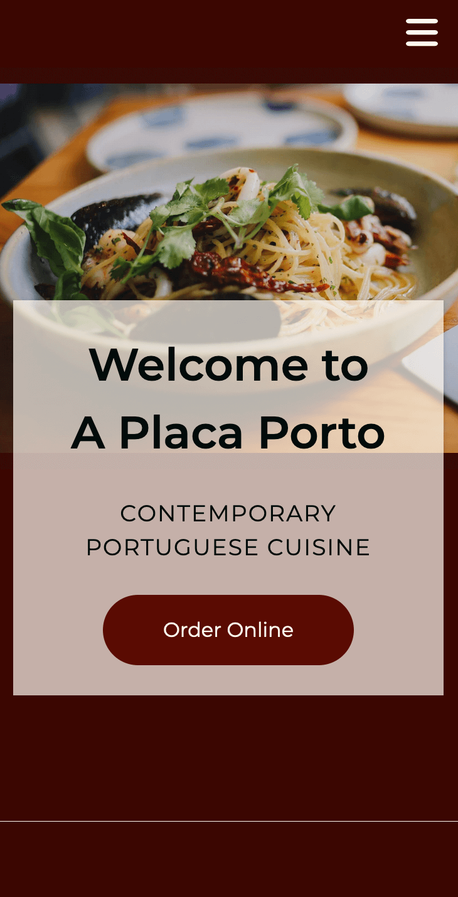
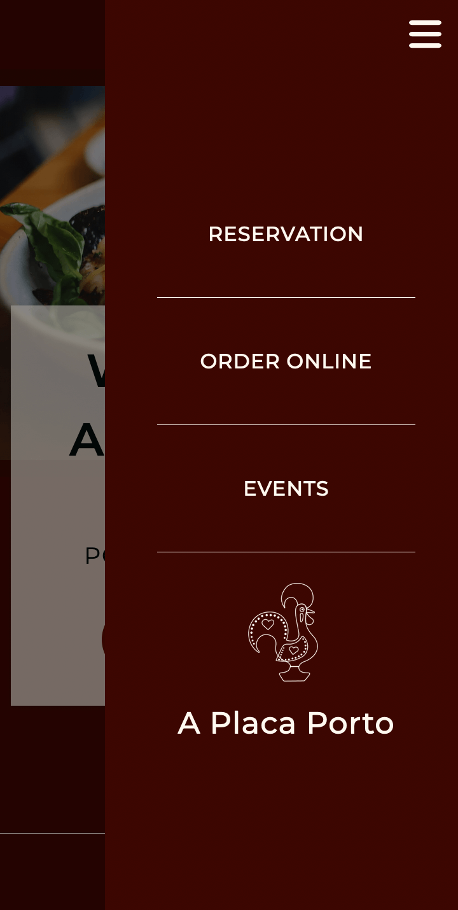

# Mobile-First Landing Page with SASS

<div align="center">
  
</div>

## Table of contents

- [Overview](#overview)
  - [Links](#links)  
  - [The challenge](#the-challenge)
- [My process](#my-process)
  - [Built with](#built-with)
  - [What I learned](#what-i-learned)
  - [Continued development](#continued-development)
  - [Useful resources](#useful-resources)
- [Author](#author)

## Overview

### Links

- View live page: [SASS Landing Page](https://rileydevdzn.github.io/sass-landing-page/)

### The challenge

For this project, I decided to create a landing page for a restaurant, incorporating a bold but simple color scheme with a lot of visuals.

I wanted to challenge myself by creating the mobile version first, then expanding the design to fill the extra space on desktop. I also wanted to dive deeper into SASS mixins, arguments and flow control.

My build needed to fulfill the following:

- mobile-first design
- highly visual layout with photos and video
- card and text overlays with shifting layouts from mobile to desktop
- interactive buttons and links with hover states

<div align="center">
  
  
  <p><em>Mobile design with menu closed (left) and open (right)</em></p>
</div>


## My process

### Built with

- Mobile-first design
- Semantic HTML5 markup
- SASS
- Flexbox & Grid


### What I learned

#### *Optional arguments and default values*

I used arguments to make my mixins more flexible and allow them to be customized each time they're called. 

When using Flexbox, for example, I found myself often repeating the same declarations (display: flex, align-items, justify-content), so I created a mixin using arguments `$display`, `$align`, and `$justify` that would allow me to customize these values as needed.

```scss
@mixin place-ctr($display, $align, $justify) {
  display: $display;
  align-items: $align;
  justify-content: $justify;
}
```

This worked well for my Flexbox styling, but for positioning, which had more potential options, I found customizing arguments weren't enough by themselves. I resolved this by making the arguments optional, defining default values that would be passed if the argument isn't passed.

This was very helpful for positioning, I could choose exactly which properties (top, left, bottom, right) I needed for each situation and any type of positioning.

```scss
@mixin position($pos, $top: auto, $left: auto, $btm: auto, $right: auto) {
  position: $pos;
  top: $top;
  left: $left;
  bottom: $btm;
  right: $right;
}
```

#### *Content blocks*

As I was building and expanding the design from mobile to desktop, different sections needed slightly different styling as the viewport grew. I used the `@content` at-rule to create content blocks that could take blocks of styles for media queries to accomodate this.

I named the media queries using abstracted meanings to make it easier to update and maintain – I can change the values to easily update all of my code as needed but the names can remain the same. 

The naming represents a logical relationship between the breakpoints (plant is larger than a sprout, sprout is larger than a seed), but also allowed me to avoid explicit numbers or referring to specific devices that may become outdated.

```scss
@mixin bp($point) {
  @if $point == plant {
    @media (min-width: 1600px) { @content; }
  }
  @if $point == sprout {
    @media (min-width: 1000px) { @content; }
  }
  @if $point == seedling {
    @media (min-width: 912px) { @content; }
  }
  @if $point == seed {
    @media (min-width: 600px) { @content; }
  }
}
```

The layout shifts from mobile to desktop were the most difficult part of this project and required the most additional code. This is an area I'd like to revisit and see if I can create a more flexible design that allows the content to flow more naturally with fewer required explicit declarations.

#### *Creating light- and dark-themed buttons*

Next, I combined parameters, default values and conditionals with `@if` and `@else` to create light and dark themed buttons. 

```scss
@mixin button-colors($light-button: true) {
  @if $light-button {
    background-color: $body-txt-color;
    color: $accent-red;
  } @else {
    background-color: $accent-red;
    color: $body-txt-color;
  }
}
```

Putting it all together, with parameters and default values along with the mixins for media queries and `&:hover`, I created a single source that controls the appearance and hover behavior of all the links on the page across device sizes and can be called with a single-line declaration. 

```scss
.btn.dark {
  @include button-colors($light-button: false);
}
.btn.light {
  @include button-colors($light-button: true);
}
```

This allowed me to create a consistent appearance aligned with the theme colors and ensure consistent behavior throughout the page. I can also quickly update the appearance and behavior as needed by making a few changes in the mixin.


### Continued development

I'm quite comfortable with the SASS syntax, and my goal now is to improve my skills and write more efficiently. 


## Author

- Website - [Riley Portfolio](https://rileydevdzn.webflow.io)
- Frontend Mentor - [@rileydevdzn](https://www.frontendmentor.io/profile/rileydevdzn)
