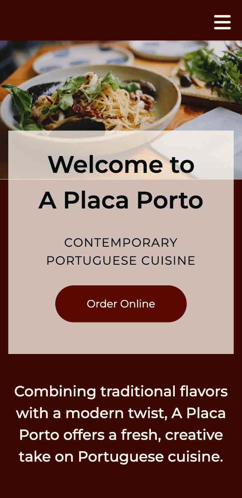
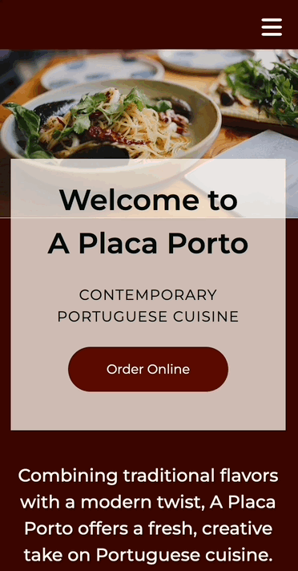
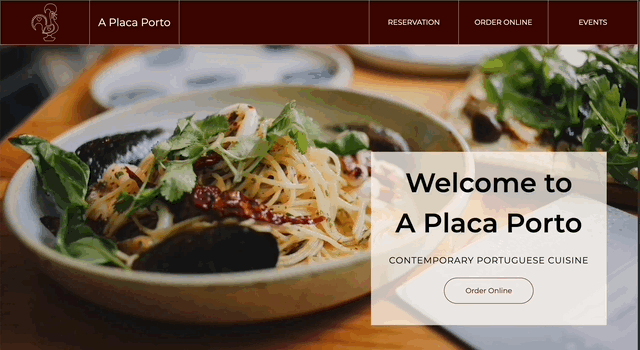

# Mobile-First Landing Page with SASS

<div align="center">
  <picture>
    <source media="(max-width: 1199px)" srcset="./sass-landpg-hero-mobile.png"/>
    <source media="(min-width: 1200px)" srcset="./sass-landpg-hero-desktop.png"/>
    
  </picture>
  <p>Landing Page Hero</br><em><small>(Hint: if you're on desktop, resize the browser window to see the mobile version)</small></em></p>
</div>

</br>

## Table of contents

- [Overview](#overview)
  - [Links](#links)  
  - [Highlights](#highlights)
- [Build details](#build-details)
  - [Features](#features)
  - [Challenges](#challenges)
  - [What I learned](#what-i-learned)
  - [Continued development](#continued-development)
  - [Useful resources](#useful-resources)
- [Author](#author)

</br>

## Overview

For this project, I created a landing page for a fictional Portuguese restaurant, incorporating a bold but simple color scheme with a lot of visuals.

I wanted to challenge myself by creating the mobile version first, then expanding the design to fill the extra space on desktop. In the process, I dove deeper into SASS mixins, arguments and flow control.

My build needed to fulfill the following:

- mobile-first design
- highly visual layout with photos and video 
- card and text overlays with shifting layouts from mobile to desktop
- interactive buttons and links with hover states

</br>

### Links

View live page: [SASS Landing Page](https://rileydevdzn.github.io/sass-landing-page/)

</br>

### Highlights

- Mobile-first design
  - [CSS-only mobile hamburger menu](#css-only-mobile-hamburger-menu)
- Semantic HTML5 markup
  - [Fluid typography with SASS variables](#fluid-typography)
- Flexbox & Grid
  - [Fluid layouts expanding from mobile to desktop](#fluid-layouts-and-additional-design-details-on-wider-screens)
- SASS
  - variables, nested rules, [content blocks](#content-blocks) and [mixins with flow control and optional arguments](#optional-arguments-and-default-values-in-sass)
  - [creating light- and dark-themed button variations](#creating-light--and-dark-themed-buttons)

</br>

</br>

## Build details

### Features

#### *CSS-only mobile hamburger menu*

For this design, I decided to keep things simple and built the mobile navigation menu using just CSS.

The mobile nav menu slides down from the top of the page when the user taps the hamburger menu (checkbox input + label) and slides back up out of view on second tap.

<div align="center">
  
  <p><em>Mobile design demo of hamburger menu</em></p>
</div>

</br>

#### *Fluid typography with SASS variables*

To make text scale automatically with the screen size, I used the CSS `clamp()` function and viewport units. I also incorporated variables to make the values easy to update with a single change. I first set a base variable, `$font-sz-base` for the font size (in this case 16px), then used that variable in all of my calculations. 

By using variables in my typography calculations instead of explicitly declaring the values, I can make a single change that will propagate and automatically update all my font sizes. Combining this with the fluid typography, I can update all the font sizes for all screen sizes with a single change to `$font-sz-base`. While this requires more calculations up front, it makes the code easier to update and maintain in the long run.

```scss
$h1-font-sz: clamp(calc(2.25 * $font-sz-base), calc(1.725 * $font-sz-base) + 2.25vw, calc(3.75 * $font-sz-base));
```
</br>

#### *Fluid layouts and additional design details on wider screens*

A clean design and ease of functionality were the priority for the mobile design. I used a simple single column layout on smaller screens to let the video and images take center stage with a clear call-to-action in each section.

I added additional design details as the screen size increased, shifting from a single to a two-column layout; using CSS Grid and adding borders to create a gridded visual effect for desktop devices. 

I then replicated this gridded visual in the sticky horizontal top navigation bar for the desktop design. 

<div align="center">
  
  <p><em>Desktop design demo</em></p>
</div>

</br>

### Challenges

The layout shifts from mobile to desktop were the most difficult part of this project and required the most additional code with media queries. This is an area I'd like to revisit and see if I can create a more flexible design that allows the content to flow more naturally with fewer required explicit declarations.

</br>

### What I learned

#### *Optional arguments and default values in SASS*

I used arguments to make my mixins more flexible and allow them to be customized each time they're called. 

When using Flexbox, for example, I found myself often repeating the same declarations (display: flex, align-items, justify-content), so I created a mixin using arguments `$display`, `$align`, and `$justify` that would allow me to customize these values as needed.

```scss
@mixin place-ctr($display, $align, $justify) {
  display: $display;
  align-items: $align;
  justify-content: $justify;
}
```

This worked well for my Flexbox styling, but for positioning, which had more potential options, I found customizing arguments weren't enough by themselves. I resolved this by making the arguments optional, defining default values that would be passed if the argument isn't passed.

This was very helpful for positioning, I could choose exactly which properties (top, left, bottom, right) I needed for each situation and any type of positioning.

```scss
@mixin position($pos, $top: auto, $left: auto, $btm: auto, $right: auto) {
  position: $pos;
  top: $top;
  left: $left;
  bottom: $btm;
  right: $right;
}
```

#### *Content blocks*

As I was building and expanding the design from mobile to desktop, different sections needed slightly different styling as the viewport grew. I used the `@content` at-rule to create content blocks that could take blocks of styles for media queries to accomodate this.

I named the media queries using abstracted meanings to make it easier to update and maintain; I can change the values as needed but the names can remain the same. 

The naming represents a logical relationship between the breakpoints (plant is larger than a sprout, sprout is larger than a seed), but also allowed me to avoid explicit numbers or referring to specific devices that may become outdated.

```scss
@mixin bp($point) {
  @if $point == plant {
    @media (min-width: 1600px) { @content; }
  }
  @if $point == sprout {
    @media (min-width: 1000px) { @content; }
  }
  @if $point == seedling {
    @media (min-width: 800px) { @content; }
  }
  @if $point == seed {
    @media (min-width: 600px) { @content; }
  }
}
```

#### *Creating light- and dark-themed buttons*

Next, I combined arguments, default values and conditionals with `@if` and `@else` to create light and dark themed buttons. 

```scss
@mixin button-colors($light-button: true) {
  @if $light-button {
    background-color: $body-txt-color;
    color: $accent-red;
  } @else {
    background-color: $accent-red;
    color: $body-txt-color;
  }
}
```

Putting it all together, with arguments and default values along with the mixins for media queries and `&:hover`, I created a single source that controls the appearance and hover behavior of all the links on the page across device sizes and can be called with a single-line declaration. 

```scss
.btn.dark {
  @include button-colors($light-button: false);
}
.btn.light {
  @include button-colors($light-button: true);
}
```

This allowed me to create a consistent appearance aligned with the theme colors and ensure consistent behavior throughout the page. I can also quickly update the appearance and behavior as needed by making a few changes in the mixin that will propagate throughout the page.

</br>

### Continued development

I'm quite comfortable with the SASS syntax, and my goal now is to improve my skills and write more efficiently. 

</br>

## Author

- Riley - [View Portfolio](https://rileydevdzn.webflow.io)


<!--Photo links
hero-bg: https://unsplash.com/photos/KSXvrqKUxnc
video: https://www.pexels.com/video/joyful-family-toasting-drinks-on-family-gathering-5617275/
book-table: https://www.pexels.com/photo/delicious-portuguese-eggs-tart-on-paper-5677314/
menu-bg: https://unsplash.com/photos/mvu1-Gzg1tg
subscribe: https://unsplash.com/photos/eabRpSX4a1A
-->